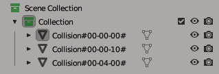

# RE4-SAT-EAT-TOOL
Extract and repack RE4 SAT-EAT files (RE4 ubisoft/2007/steam/uhd/Ps2)

Translate from Portuguese Brazil

Programas destinados a extrair e reempacotar arquivo .SAT .EAT do RE4 de PS2, 2007, UHD.
 SAT: é o arquivo de colisão para o player, inimigos, Ashley e a câmera;
 EAT: é o arquivo de colisão para os projéteis, granadas e ovos, e para os itens que cai ao atirar neles;
 Nota: Fiz vários testes, porém não posso garantir que vai funcionar 100% das vezes, caso você encontre algum erro que possa ser do programa, me contate (e-mail);

## RE4_SAT_EAT_Extract.exe

Programa destinado a extrair o arquivo SAT ou EAT;
(escolha o .bat da mesma versão do seu jogo, caso você escolher a versão errada, o programa não vai dar erro, porem o arquivo .obj vai ficar errado) 
O programa ira gerar os arquivo:

* .OBJ, esse é o arquivo no qual vai ser editado, veja as informações abaixo.
* .IDXSAT, esse arquivo é necessário para o repack, com ele você ira recriar um arquivo SAT;
* .IDXEAT, esse arquivo é necessário para o repack, com ele você ira recriar um arquivo EAT;
* Nota: você pode receber de 1 a vários arquivos .obj;
* Nota2: você só vai ter somente um dos dois IDX vai depender de qual arquivo você extraiu;

**OBJ FILE**

A escala do arquivo é 100 vezes menor que a do jogo, sendo Y a altura.
  O nome desse arquivo é o nome do arquivo extraído mais um número, ex: filename_0.obj

Veja o Exemplo:
 

  O nome dos objetos tem que ser exatamente como é descrito abaixo:
  Nota: o programa não diferencia minúsculas de maiúsculas.

A nomenclatura dos nomes dos grupos/objetos pode ser:
 **Collision#00-00-00#**
 **Collision\_00-00-00\_**

Sendo:
* É obrigatório o nome do grupo começar com "Collision", e ser divido por # ou _
* A ordem dos campos não pode ser mudada;
* Sendo 00 um número em hexadecimal que vai de 00 a FF;
* Os números devem ser divididos pelo sinal de menos -
* Esses números, na verdade, são um conjunto de flags, então cada bit significa uma coisa, veja a sessão de **Flags** para saber mais;
* Cada um desses 3 bytes represento por uma cor, sendo na ordem: Blue, Green e Red;

  ----> Sobre verificações de grupos:
  * No Repack se ao lado direito do nome do grupo aparecer o texto "The group name is wrong;", significa que o nome do grupo está errado, e o seu arquivo vai ficar errado;
  * E se ao lado direito aparecer "Warning: Group not used;" esse grupo esta sendo ignorado pelo meu programa, caso, na verdade, você gostaria de usá-lo, você deve arrumar o nome do grupo;

## RE4_SAT_EAT_Repack.exe

Programa destinado a reempacotar o arquivo SAT-EAT;
  Nota: escolha o .bat da mesma versão do seu jogo.
  (Mas caso você queira converter o arquivo de uma versão para outra, é só escolher a versão do jogo na qual você vai colocar o seu arquivo.)

## Sobre .idxsat / .idxeat
  Os dois tipos de idx tem o mesmo tipo de conteúdo, o nome é diferente para que o arquivo gerado pelo repack seja do formato correto;
  Nota: Na verdade, você não precisa editar o conteúdo desse arquivo;
  Segue a baixo a lista de comando presente no arquivo:
* Magic: o valor pode ser 80 ou 20, sendo que 80 pode ter 1 ou mais arquivo .obj, e 20 somente 1 arquivo .obj;
* Count: essa é a quantidade de arquivos obj;
* Dummy: esse é um campo em hexadecimal de 2 bytes, esse campo só é valido se o Magic for 80, não sei para que serve esse campo no arquivo, mas é para não ter utilidade no arquivo.

## Sobre Flags e converter da "SoP Tool"

Abaixo vou explicar como converter o seu arquivo usado na Tool do SoP-SAT-EAT, para a minha Tool;
  Aviso: faça backup de seus arquivos antes de mudar, não me responsabilizo por perdas de dados;
  Para saber os nomes das flags de cada byte veja o arquivo Flags.md desse repositório;
  Atenção: As flags usadas no Eat são diferentes das usadas no Sat, então mesmo que sejam o mesmo valor, os significados são diferentes;
  Para cada byte, eu nomeei de uma cor:

Minha tool para ambas as versões do jogo:
 **Collision#BB-GG-RR#**

 Para a tool do "Son of Percia" a ordem dos bytes muda de acordo com a versão do jogo:

  Para UHD:
 **object\_?\_0xNN\_0xNN\_0xRR\_0x0xYY\_0xBB\_0xGG**

  Para 2007-PS2:
 **object\_?\_0xNN\_0xNN\_0xBB\_0xGG\_0xRR\_0xYY**

  sendo:
* **NN**: o valor desses dois bytes é sempre 0 (zero), eles não são utilizados pelo jogo;
* **BB**: esse é o byte de cor BLUE;
* **GG**: esse é o byte de cor GREEN;
* **RR**: esse é o byte de cor RED;
* **YY**: esse é o byte de cor YELLOW, esse byte omitido no meu programa, pois o programa calcula o valor desse byte automaticamente, ele define as conexões das edges de cada triangulo/face;

## Código de terceiro:

[ObjLoader by chrisjansson](https://github.com/chrisjansson/ObjLoader):
Encontra-se no RE4_SAT_EAT_REPACK, código modificado, as modificações podem ser vistas aqui: [link](https://github.com/JADERLINK/ObjLoader).

**At.te: JADERLINK**
 2023-12-27